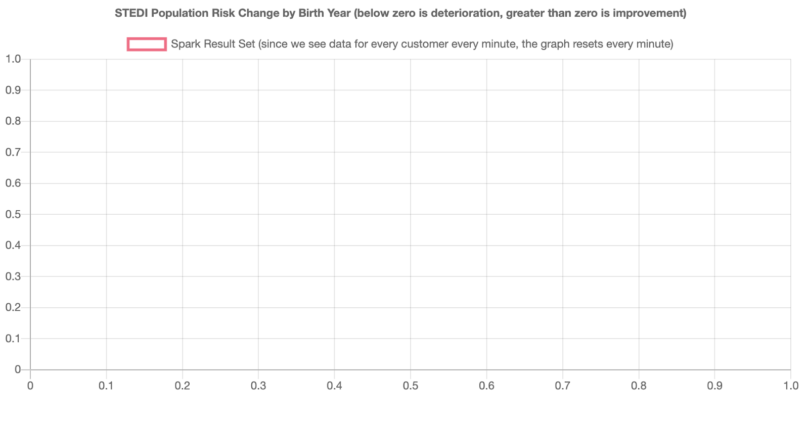

## Project Overview

A data science team at STEDI, a small startup focused on assessing balance for seniors, has an application (STEDI application) that collects data from seniors during a small exercise. The user logs in and then selects the customer they are working with. Then the user starts a timer and clicks a button with each step the senior takes. When the senior has reached 30 steps, their test is finished. The data transmitted enables the application to monitor seniors’ balance risk.

## A New Product Feature

The product manager has requested a graph that shows fall risk (will they fall and become injured?) for recent assessments. The development team has built a graph, which is ready to receive risk information from Kafka:

## The Data

The STEDI data science team has configured some real-time data sources using Kafka Connect. One of those data sources is Redis. When a customer is first assessed in the STEDI application, their record is added to a sorted set called Customer in Redis. Redis is configured as a Kafka source and whenever any data is saved to Redis (including Customer information), a payload is published to the Kafka topic called redis-server.

## Implementation and Result

The project is implemented with Kafka and Spark to extract the datasets, transorm them, and then use the processed to update the graph:

